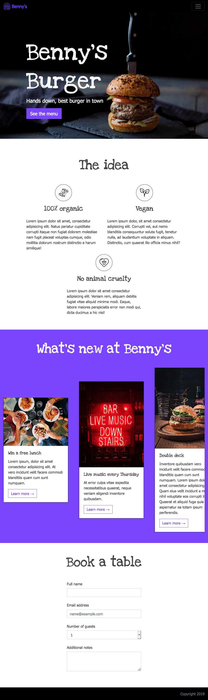

# Benny's burger

> Let's use Bootstrap to create a restaurant page!

## Desktop:

* site header is sticky to the top 
* add scroll to section - on click on the items in the menu, scroll to section

## Tablet

## Mobile

## Customize Bootstrap

Let's customize the site!

* set a custom primary color
* set a custom font family: https://fonts.google.com/specimen/Love+Ya+Like+A+Sister
* set a custom size for display headlines
* customize the space between `form-group`-s
* increase lead size
* remove rounded borders across the entire site
* change card border to primary color

Note: have a look into the `node_modules/scss/bootstrap/_variables.scss` file to see what variables you need to target to set your custom values.
